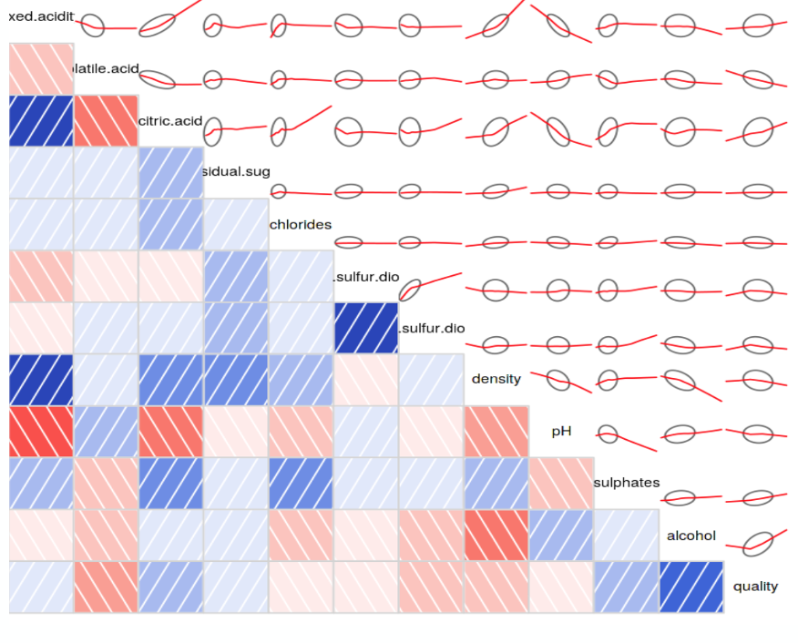
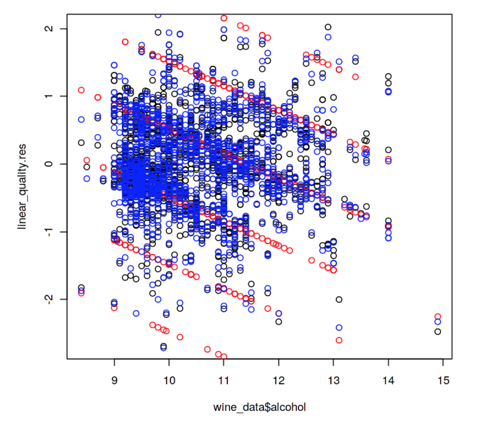
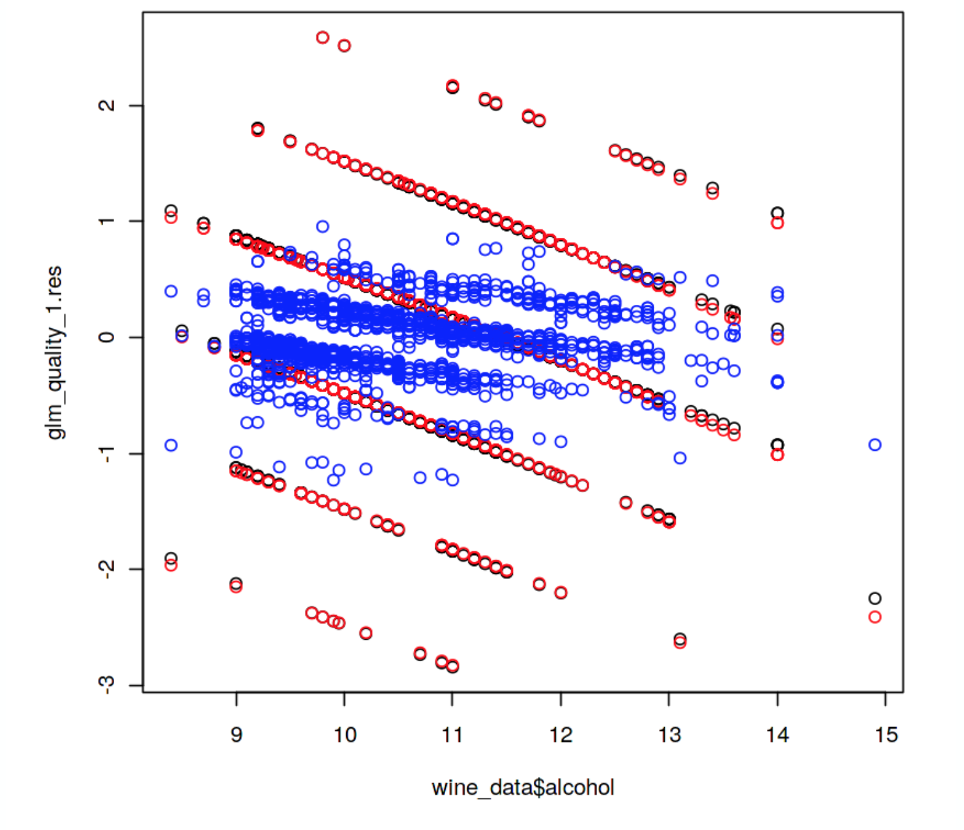
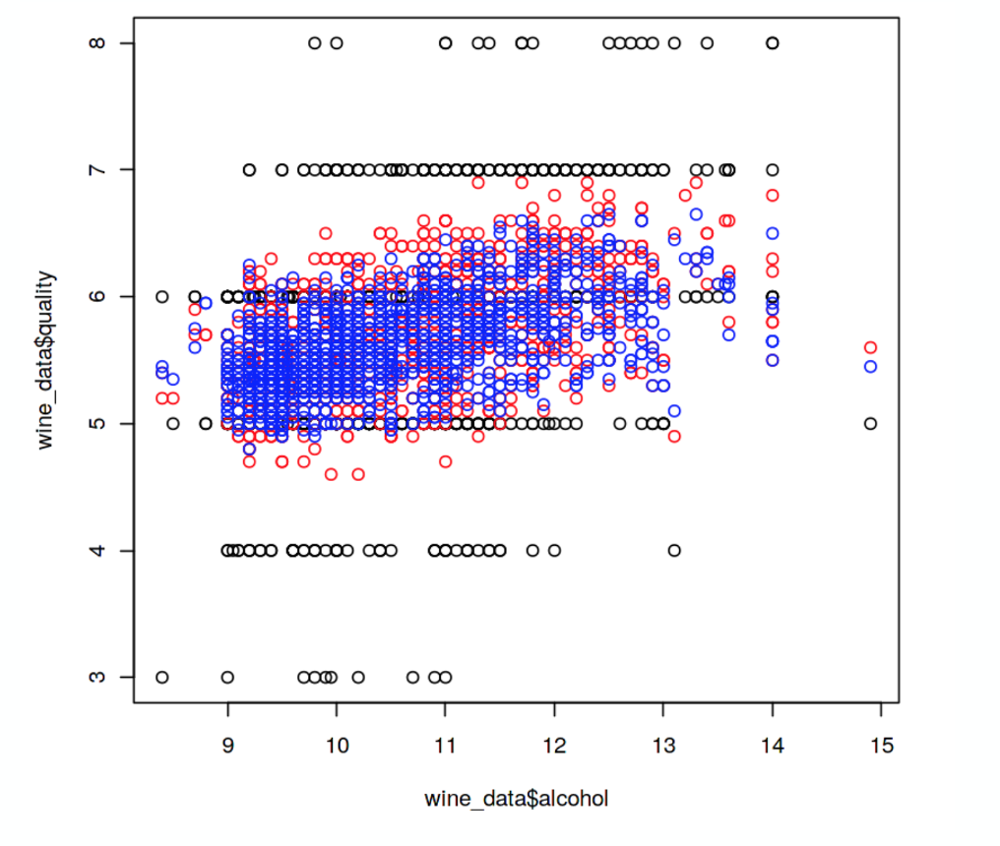
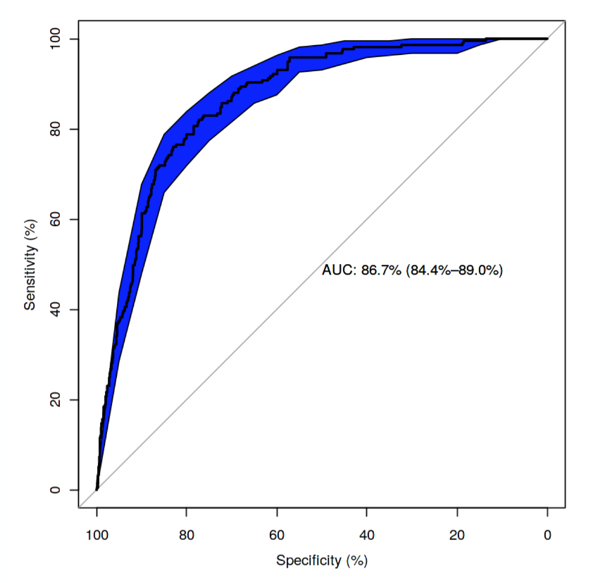
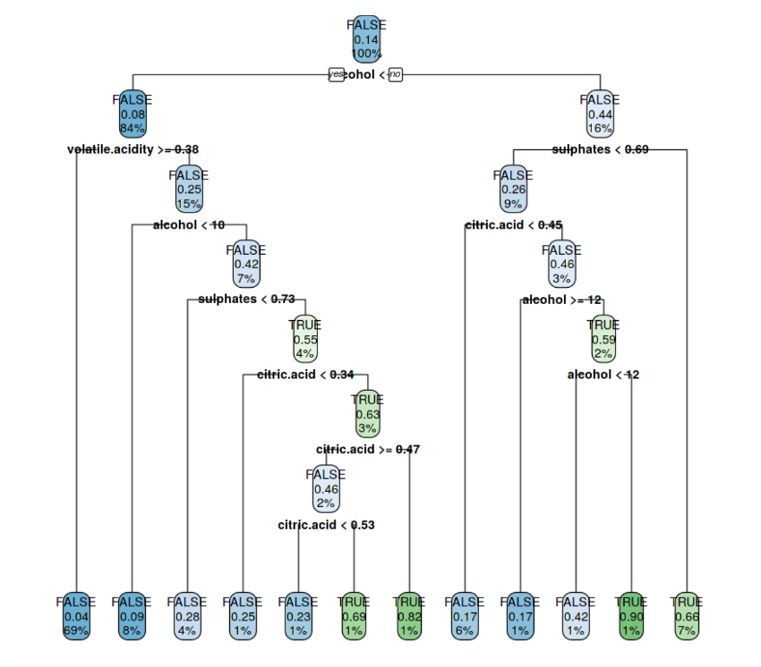

# <c> Red-Wine-Quality </c>

Source: https://www.kaggle.com/uciml/red-wine-quality-cortez-et-al-2009

12 numerical data elements with 1600 records.
Regression and classification techniques.

<h2> Regression: </h2> Linear, logistic, K-means
<h2> Classification: </h2> Logistic, K-nearest,  decision trees

<h1> Correlation Matrix </h1>

<h1> Methods </h1>
Regression approaches to predict quality score
1. linear regression
2. generalized linear regression
3. k-nearest neighbors approach

<h2>Linear Regression</h2>

<h2>Logistic Regression</h2>

<h2>K-Nearest Regression</h2>

Classification approaches to predict quality score
1.Logistic function fit
2.Decision trees

<h2>Logistic Function Fit</h2>

<h2>Decision trees</h2>

